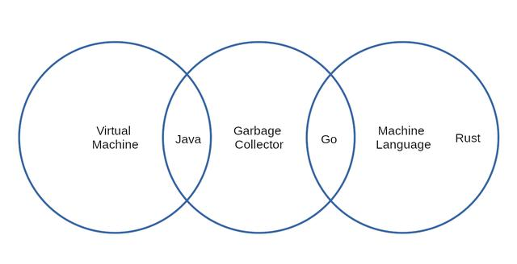

<!--
 * @Author: your name
 * @Date: 2021-09-14 10:13:19
 * @LastEditTime: 2021-09-14 10:20:45
 * @LastEditors: Please set LastEditors
 * @Description: In User Settings Edit
 * @FilePath: /rust-helloworld/md/Java、Go、Rust.md
-->
# Java、Go、Rust

三种语言的比较

在得出任何结论之前，我想指出这三种语言之间的关系。Java和Go都是支持垃圾回收的语言，但是Java会提前编译为在JVM上运行的字节码。启动Java应用程序时，JIT编译器会被调用以通过将字节码编译为本地代码来优化字节码，以提高应用程序的性能。

Go和Rust都提前编译为本地代码，并且在运行时不会进行进一步的优化。

Java和Go都是支持垃圾收集的语言，具有**STW(停止世界）**的副作用。这意味着，每当垃圾收集器运行时，它将停止应用程序，进行垃圾收集，并在完成后从停止的地方恢复应用程序。大多数垃圾收集器需要停止运行，但是有些实现似乎不需要这样做。

当Java语言在90年代创建时，其最大的卖点之一是 一次编写，可在任何地方运行。当时这非常好，因为市场上没有很多虚拟化解决方案。如今，大多数CPU支持虚拟化，这种虚拟化抵消了使用某种语言进行开发的诱惑(该语言承诺可以运行在任何平台上)。Docker和其他解决方案以更为低廉的代价提供虚拟化。